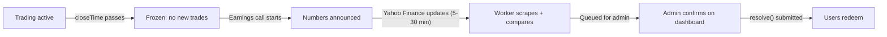
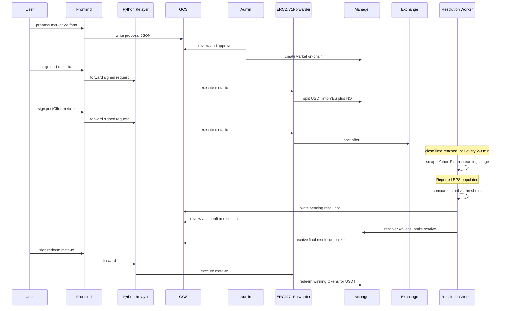
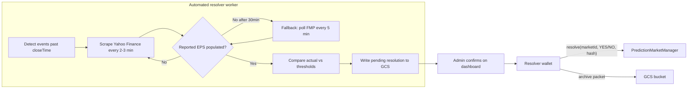
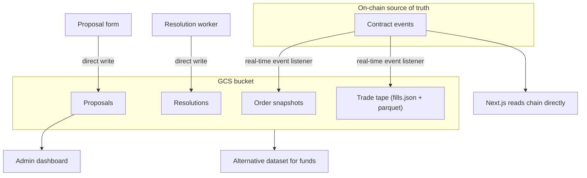

## Implementation status (code vs doc)

Use this block to spot drift between this plan and the repo; update it when behavior changes materially.

- **Contracts:** BSC testnet deploy path for factory, manager, exchange, forwarder, tokens; Hardhat tests run on the local `hardhat` network via `yarn hardhat:test:unit`.
- **Backend:** Lazy GCS client; FastAPI proposals + resolution pending/confirm; `confirm` submits `resolve()` from **`RESOLVER_PRIVATE_KEY`** when set, otherwise records `onChain.skipped`; proposal **approve** uses **`FACTORY_OWNER_PRIVATE_KEY`** (or `DEPLOYER_PRIVATE_KEY`); **`RELAYER_PRIVATE_KEY`** is **only** for `POST /relay/forward` (must be a **different** key from the resolver — enforced at import). `POST /relay/forward` is the only supported gas-sponsored execution path for integration.
- **Testing:** `yarn test` = unit tests + pytest; `yarn hardhat:test:testnet` = live RPC scripts (Python relay + six-wallet).
- **Exchange:** Still **high-trust by design** for the hackathon vertical; see [README.md](README.md).
- **Evidence hash:** Canonical JSON + `keccak256` in `packages/backend/app/resolution.py`; recompute with `verify_evidence_hash` against GCS payloads to match on-chain `MarketResolved`.
- **Deferred (explicit):** Automated env-gated testnet integration suite (relay + resolve + log/evidence checks, BUY/NO coverage) — tracked in this file’s YAML todo `testnet-automated-integration-suite`; runbook steps stay in [TESTING.md](TESTING.md) until then.

# Prediction market refactor: contracts + off-chain (fund-KPI vertical + CLOB)

## Context: what you have today

- `[packages/hardhat/contracts/PredictionMarket.sol](packages/hardhat/contracts/PredictionMarket.sol)`: single binary market, **native ETH** collateral, **AMM-style** pricing, **one EOA oracle** (`report`), LP-only liquidity, custom YES/NO ERC20s from `[PredictionMarketToken.sol](packages/hardhat/contracts/PredictionMarketToken.sol)`.
- `[packages/hardhat/deploy/00_deploy_your_contract.ts](packages/hardhat/deploy/00_deploy_your_contract.ts)`: deploys one market; LP and oracle both `deployer`.
- **No** dedicated backend; Next.js under `[packages/nextjs/](packages/nextjs/)` only.

---

## Product scope (brief)

US-only companies. **Target scale: 100--1000 users.** Markets on **quarterly earnings call KPIs** (EPS, revenue, net income, etc.) -- the headline numbers announced during earnings calls and press releases. **Not** tied to the slower 10-Q/10-K filings. Resolution happens **within minutes** of the earnings announcement via automated scraping. Markets are grouped into **events** (e.g., "Apple Q2 2026 Earnings") with multiple **sub-markets** per event (e.g., "EPS > $1.60?", "EPS $1.50--$1.60?", etc.). Each market has a plain-English resolution block + hashed `resolutionSpec` on-chain. **Anyone can propose** an event via a UI form; **admin approves** before it goes on-chain.

---

## MVP resolution: automated fetch + admin confirmation (hackathon-grade)

### Data sources (finalized)

Markets focus on **earnings calls** -- the live event where a company announces headline numbers (EPS, revenue, etc.) via a press release and call. Resolution must happen **within minutes** of the numbers dropping, not hours later.

**How earnings data flows after the call:**

1. **T+0 sec:** Company issues press release via wire service (Business Wire / PR Newswire)
2. **T+seconds:** Data aggregators (Refinitiv/LSEG, Bloomberg) parse headline numbers
3. **T+5-30 min:** Consumer platforms (Yahoo Finance, Google Finance) reflect reported EPS/revenue
4. **T+30 min to hours:** FMP picks it up from SEC 8-K filing
5. **T+days to weeks:** Full 10-Q with detailed financials available

**Primary: custom Yahoo Finance scraper** (fastest free source)

Yahoo Finance is powered by Refinitiv (LSEG), one of the fastest data aggregators. The earnings data appears on the Yahoo Finance website within **5-30 minutes** of the press release -- much faster than any free API.

Scrape targets:

- **Earnings calendar page:** `https://finance.yahoo.com/calendar/earnings?symbol=AAPL` -- shows "Reported EPS" and "Surprise (%)" columns. When "Reported EPS" populates, data is live.
- **Individual quote page:** `https://finance.yahoo.com/quote/AAPL/` -- EPS (TTM) updates on the quote summary.

Implementation: Python `requests` + `BeautifulSoup` (or `pandas.read_html` for the earnings table). Simple `User-Agent` header, polite polling interval (every 2-3 min). At hackathon volume (a few companies per quarter), Yahoo won't care. If the earnings table is JavaScript-rendered, fall back to Selenium/Playwright for one-off page loads.

**Risks and mitigations:**
- HTML structure change: test scraper before demo day, write selectors defensively, have FMP fallback
- Anti-bot blocking: very low request volume, proper headers, not a concern for hackathon
- JavaScript-only content: test with simple `requests` first; if table isn't in initial HTML, use Playwright

**Secondary (fallback): FMP (Financial Modeling Prep) API** -- [financialmodelingprep.com](https://site.financialmodelingprep.com)

Proper REST API, free tier (250 calls/day), structured JSON. Slower to update (waits for SEC 8-K filing, typically 30 min to a few hours), but guaranteed structured data. Used as:
- **Cross-verification:** after scraper returns a number, FMP confirms it within an hour
- **Fallback:** if scraper fails (HTML changed, got blocked), FMP is the backup
- Key endpoint: `GET /stable/earnings-surprises?symbol=AAPL` -- returns `epsActual`, `revenueActual` per quarter

### Resolution approach: LLM-assisted extraction + deterministic comparison

For the kinds of markets we're building (EPS > $1.60?, Revenue > $95B?), scraped data is parsed with an LLM-assisted extractor, then resolved by deterministic comparison.

```
Scraper returns: Reported EPS = 1.53, Revenue = $94.2B

Sub-market: "EPS > $1.60?" → 1.53 < 1.60 → NO
Sub-market: "EPS $1.50-$1.60?" → 1.50 <= 1.53 < 1.60 → YES
Sub-market: "Revenue > $95B?" → 94.2B < 95B → NO
```

LLM output is not trusted blindly. Before queueing resolution, backend validators must pass:
- numeric extraction must pass strict regex/unit checks
- metric must match supported enum (`eps`, `revenue`, `netIncome`)
- normalized values must be stored in canonical units in GCS

Normalization is locked:
- `eps`: decimal number (e.g., `1.53`)
- `revenue` and `netIncome`: integer USD (e.g., `94200000000`)
- UI formatting (`B`, `M`, commas) is display-only; backend compares normalized values only

### The resolution gap: what happens between closeTime and resolution

There is a short delay between when trading stops (`closeTime`) and when the market is resolved on-chain. This is normal -- every prediction market works this way, but we minimize it with aggressive polling.



**Timeline for a typical market:**

1. **Admin sets `closeTime`** to **before** the scheduled earnings call (e.g., 30-60 min before, or at market close on earnings day). Prevents front-running.
2. **`closeTime` passes:** `split`, `merge`, `postOffer`, `fillOffer` all revert. Market is frozen. Users can only `cancelOffer`.
3. **Earnings call happens:** Company announces numbers via press release. On-chain status is still `Open` but no trading is possible.
4. **Yahoo Finance updates (5-30 min):** Reported EPS populates on the earnings calendar page.
5. **Worker scrapes and detects data:** Worker has been polling every **2-3 minutes** since the expected earnings call time. As soon as "Reported EPS" appears, it grabs the number.
6. **Worker queues resolution:** Compares actual value against each sub-market's threshold. Writes proposed resolution to GCS (`resolutions/{eventId}/pending.json`) with scraped data, page snapshot, and proposed YES/NO per sub-market. **Does NOT call `resolve()` yet.**
7. **Admin confirms:** Admin sees pending resolution on the dashboard (same UI as market proposal approvals). Shows: scraped value, threshold, proposed outcome, raw source. Admin clicks **"Confirm"** to proceed, or **"Override"** with a corrected outcome + notes.
8. **On-chain resolution:** On admin confirmation, backend calls `resolve(marketId, outcome, evidenceHash)` for each sub-market. Archives full packet to GCS.
9. **Users redeem** winning tokens for USDT.

**Target resolution speed: 10-35 minutes** after the earnings announcement (5-30 min scraper + 1-5 min admin review). Still much faster than Polymarket.

**During the frozen period (steps 2-6), the backend:**
- Polls Yahoo Finance earnings page every **2-3 minutes** for the target ticker
- Checks if "Reported EPS" / "EPS Actual" field has populated
- Logs each poll attempt (timestamp, response status, data found or not)
- If scraped successfully: writes pending resolution to GCS, notifies admin (dashboard shows new item in queue)
- If scraper fails after 30 minutes: falls back to polling FMP every 5 minutes
- If both sources fail after 24 hours: escalates to admin alert

**Admin resolution dashboard** (same page as proposal approvals):
- Shows pending resolutions per event: ticker, metric, scraped actual value, each sub-market's proposed outcome
- Shows the raw scraped HTML snapshot for verification
- FMP cross-check value shown alongside (when available) for sanity
- **"Confirm All"** button to approve all sub-markets in an event at once
- **"Override"** per sub-market: admin manually sets YES/NO with a reason note
- Override requires non-empty `overrideReason`; reason is stored in GCS and included in the evidence hash payload
- On confirm/override: backend fires `resolve()` on-chain for each sub-market
- Confirm action is idempotent: backend checks market status before sending tx, disables duplicate clicks in UI, and uses a per-event lock to prevent double-submit race conditions

**Frontend status during the gap:** Shows "Trading closed -- awaiting earnings results" then "Resolution pending admin confirmation" with a live status indicator.

---

## Target architecture (high level)




---

## Smart contract architecture (locked-in decisions)

**Collateral:** ERC20 stablecoin -- **USDT on BSC** (18 decimals). Mock ERC20 for local/testnet (also 18 decimals to match).
**Outcome shares:** **ERC1155** -- one contract holds all markets' positions.
**Pattern:** **Central manager** (single set of contracts keyed by `marketId`), not per-market deploys.
**AMM:** **Removed entirely.** Trading is order-book only.
**Gas sponsorship:** **EIP-2771 meta-transactions** on **Manager + Exchange only**. Factory and OutcomeToken1155 do NOT inherit ERC2771Context (admin-only / infra contracts, no need). OZ `ERC2771Forwarder` verifies signed requests. Python relayer sponsors only an allowlist of function selectors (`split`, `merge`, `postOffer`, `fillOffer`, `cancelOffer`, `redeem`). `resolve()` called directly by resolver wallet (not via forwarder).
**First-tx caveat:** Users need a tiny BNB amount once to `approve(MAX)` USDT to Manager and Exchange. After that, all operations are gasless.
**Price representation:** Basis points (0--10000). 6500 = 0.65 USDT. Conversion to/from USDT wei happens in the Exchange contract.
**Fees:** None for hackathon MVP. Can be added later.
**Resolution finality:** Admin confirms before `resolve()` is submitted. Once on-chain, resolution is final (no post-resolution override).

### State ownership split

- **MarketFactory** -- immutable creation-time data only: question, closeTime, resolutionSpecHash, resolutionSpecURI, collateralToken, category. Read-only after creation.
- **PredictionMarketManager** -- all mutable state: status (`Open` / `Resolved`), winningOutcome, `totalShares` per market. Manager reads Factory for closeTime. One-direction dependency: Manager reads Factory, never the reverse.

### Access control roles

- **Owner** (deployer) -- admin config: `createMarket` on Factory, owner-only functions, can change resolver address.
- **Resolver** -- on-chain role on `PredictionMarketManager`: **only** this address may call `resolve()`. In production this should be a **dedicated admin/ops wallet** (the same trust boundary as whoever approves proposals and runs the exchange admin flows off-chain). It is **not** the gas-sponsorship relayer. Changeable by owner.
- **Users** -- everyone else. Split, merge, trade, redeem via meta-tx.

### Backend hot wallets (canon)

**`RELAYER_PRIVATE_KEY` and `RESOLVER_PRIVATE_KEY` must never be the same key.** The backend refuses to start if both are set and equal.

| Env | On-chain power | Purpose |
| --- | --- | --- |
| **`RELAYER_PRIVATE_KEY`** | None by itself | **Gas-only hot wallet.** Submits `ERC2771Forwarder.execute` for user-signed meta-txs (`split`, `merge`, `postOffer`, `fillOffer`, `cancelOffer`, `redeem`). Treat as expendable: fund with BNB, minimal privilege, no market admin duties. |
| **`RESOLVER_PRIVATE_KEY`** | Must match the contract **resolver** address | Submits `PredictionMarketManager.resolve(...)` after admin confirmation. Same **operational** circle as factory/market creation (`FACTORY_OWNER_PRIVATE_KEY` / deployer) — serious admin keys, not a throwaway relay. |
| **`FACTORY_OWNER_PRIVATE_KEY`** | Factory **owner** | `createEvent` / `createMarket` when proposals are approved. Often the deployer in dev; production policy is your ops choice, but still **distinct from the relayer** hot wallet. |

**Summary:** Relayer = dumb gas faucet for sponsored user txs. Resolver (and factory owner) = admin stack. Compromising the relayer must not grant `resolve()` or market creation.

### Token approval strategy

- **USDT to Manager + Exchange:** User calls `approve(address, type(uint256).max)` once per contract. Requires BNB for gas (one-time). After that, all `split`/`merge`/`postOffer`/`fillOffer` are gasless via meta-tx.
- **ERC1155 to Exchange:** `OutcomeToken1155` has the Exchange baked in as a **pre-approved operator** for all users. `isApprovedForAll(anyUser, exchange)` always returns true. Users never call `setApprovalForAll`. Safe because Exchange has its own escrow logic.

### Market close behavior

- When `block.timestamp >= closeTime`: `split`, `merge`, `postOffer`, `fillOffer` all revert.
- **Open offers become unfillable** (timestamp check in `fillOffer`). Makers must manually cancel to reclaim escrowed tokens.
- After resolution: only `redeem` and `cancelOffer` work.

### Redeem behavior

- `redeem(marketId)` burns ALL of the caller's winning tokens in one call. No amount parameter.
- Losing tokens are ignored (worthless, sit in wallet). No burn, no revert.
- If caller has zero winning tokens, revert with a clear error.

---

### Reference repos and key takeaways

**Gnosis Conditional Tokens (CTF)** -- foundational ERC1155 split/merge/redeem:

- `[ConditionalTokens.sol](https://github.com/Polymarket/conditional-tokens-contracts/blob/master/contracts/ConditionalTokens.sol)` -- core contract. `prepareCondition` initializes a payout vector. `splitPosition` pulls ERC20 collateral and mints ERC1155 position tokens per outcome slot using bitwise partition arrays. `mergePositions` reverses (burns positions, returns collateral). `reportPayouts` (called by oracle) sets payout numerators. `redeemPositions` burns winning tokens and returns collateral weighted by `payoutNumerator / payoutDenominator`.
- **What we take:** The split/merge/redeem primitive; single ERC1155 for all positions.
- **What we simplify:** No arbitrary partitions, no nested conditions, no combinatorial markets. Binary YES/NO only.

**Polymarket UMA CTF Adapter** -- how Polymarket wires resolution:

- `[UmaCtfAdapter.sol](https://github.com/Polymarket/uma-ctf-adapter/blob/main/src/UmaCtfAdapter.sol)` -- adapter between UMA Optimistic Oracle and CTF. `initialize` stores question params, calls `ctf.prepareCondition`, requests OO price. `resolve` pulls settled price and calls `ctf.reportPayouts`. Has admin `flag`/`pause`/`resolveManually` fallbacks.
- `[IConditionalTokens.sol](https://github.com/Polymarket/uma-ctf-adapter/blob/main/src/interfaces/IConditionalTokens.sol)` -- clean interface showing all CTF methods.
- **What we take:** Lifecycle separation (init vs resolve); admin fallbacks.
- **What we skip:** UMA integration, dispute callbacks, liveness periods.

**Gnosis pm-contracts (older):**

- [Repository](https://github.com/gnosis/pm-contracts) -- `MarketFactory`, `Market`, LMSR-based `MarketMaker`. Reference for factory patterns only.

---

### Contract 1: `OutcomeToken1155.sol`

Single ERC1155 for **all** markets' outcome positions.

**Token ID encoding (deterministic, simple):**

- `tokenId = marketId * 2` -- YES
- `tokenId = marketId * 2 + 1` -- NO
- Market 0: YES=0, NO=1. Market 1: YES=2, NO=3. Market 2: YES=4, NO=5.

**Access control:** Only `PredictionMarketManager` can `mint` and `burn` (enforced via `onlyManager` modifier). Transfers unrestricted.

**Pre-approved operator:** `isApprovedForAll` returns `true` when `operator == exchange`. Exchange address set in constructor (immutable).

**Helper functions (pure, zero gas):**
- `getYesTokenId(marketId)`, `getNoTokenId(marketId)`, `getMarketId(tokenId)`, `isYes(tokenId)` -- used by Manager and Exchange to avoid tokenId math bugs.

---

### Contract 2: `MarketFactory.sol`

Creates and stores **immutable** market metadata. Does **not** hold funds or mutable state.

#### Events and sub-markets

Markets are grouped into **events** (like Polymarket/Kalshi). Example:

- **Event:** "Apple Q2 2026 Earnings"
  - Market 0: "Apple EPS > $1.60?" (YES/NO)
  - Market 1: "Apple EPS $1.50--$1.60?" (YES/NO)
  - Market 2: "Apple EPS $1.40--$1.50?" (YES/NO)
  - Market 3: "Apple EPS < $1.40?" (YES/NO)

Each sub-market is an independent binary market with its own YES/NO tokens. The `eventId` groups them for display and resolution batching. **No on-chain mutual exclusivity enforcement** -- the resolution worker resolves them correctly (one YES, rest NO for range markets). This keeps contracts simple.

**Per-event (immutable):** `title`, `category`, `closeTime` (set once per event; all sub-markets inherit it). `require(closeTime > block.timestamp)`.

**Per-market (immutable):** `eventId`, `question` (string), `resolutionSpecHash`, `resolutionSpecURI` (optional).

**`resolutionSpec` JSON schema** (stored off-chain in GCS, hash stored on-chain):

```json
{
  "ticker": "AAPL",
  "fiscalYear": 2026,
  "fiscalQuarter": 2,
  "metric": "eps",
  "operator": ">",
  "threshold": 1.60,
  "expectedEarningsTimeUtc": "2026-07-30T20:30:00Z"
}
```

Supported `metric` values: `eps` (earnings per share), `revenue`, `netIncome`. These map to what the Yahoo Finance earnings calendar page reports. The `expectedEarningsTimeUtc` tells the worker when to start polling. Supported `operator` values: `>`, `>=`, `<`, `<=`, `between` (with `thresholdLow` and `thresholdHigh` for range markets). The worker uses this schema to make resolution a pure function: `scrape(ticker) -> compare(actualValue, operator, threshold) -> YES/NO`.

Time policy is locked: all stored timestamps are UTC (`...Z`). UI can render ET/PT for humans, but backend scheduling and comparisons use UTC only.

**Global:** single `collateralToken` address (USDT) set at deploy. No per-market collateral flexibility for v1.

`nextMarketId` and `nextEventId` auto-increment from 0.

**Solidity events:** `EventCreated(eventId, title, closeTime, category)`, `MarketCreated(marketId, eventId, question, resolutionSpecHash)`

**Functions:**
- `createEvent(title, category, closeTime)` -- owner-only. Validates `closeTime > block.timestamp`.
- `createMarket(eventId, question, resolutionSpecHash, resolutionSpecURI)` -- owner-only. Inherits closeTime and collateral from event/global config.

**Event metadata** (company, quarter, description) lives in **GCS** (`events/{eventId}/metadata.json`). On-chain stores only what's needed for indexing.

**Access:** Owner-only. Proposals from users happen off-chain (GCS). On approval, admin creates event + sub-markets. Markets go live automatically (frontend reads chain events).

---

### Contract 3: `PredictionMarketManager.sol` (central manager)

Handles all fund flows and **mutable market state** keyed by `marketId`. Holds the USDT vault. Inherits **`ERC2771Context`** + **`ReentrancyGuard`**.

**Mutable state per market:** `status` (enum: `Open`, `Resolved` -- no `Closed` state, `closeTime` handles that), `winningOutcome`, `totalShares` (number of outstanding YES+NO pairs). Reads `closeTime` from MarketFactory.

**A) `split(marketId, amount)`** -- `nonReentrant`. Pull USDT from `_msgSender()`, then mint YES+NO, then increment `totalShares`.
**B) `merge(marketId, amount)`** -- `nonReentrant`. Validate user holds both YES and NO >= amount. Burn both, send USDT, decrement `totalShares`.
**C) `resolve(marketId, outcome, evidenceHash)`** -- resolver-only, called **directly** (not via forwarder). `require(status == Open && block.timestamp >= closeTime)`. Sets winner + status. Emits `MarketResolved`.
**D) `redeem(marketId)`** -- `nonReentrant`. Burns ALL caller's winning tokens, sends equivalent USDT. Reverts if zero winning tokens. Losing tokens ignored.

A, B, D use `_msgSender()`. A + B revert if `block.timestamp >= closeTime` or `status != Open`.

**Core invariant:** `totalShares[m]` always equals the circulating supply of YES (and NO) tokens for market `m`. `USDT.balanceOf(manager) >= sum of totalShares across unresolved markets`. Holds automatically if split/merge/redeem logic is correct.

---

### Contract 4: `Exchange.sol` (order book)

Inherits `**ERC2771Context`** + `**ReentrancyGuard**` (both already in OZ 5.0.2).

#### Offer struct and price math

```solidity
enum Side { BUY_YES, BUY_NO, SELL_YES, SELL_NO }
enum OfferStatus { Active, Cancelled, Filled }

struct Offer {
    address maker;
    uint256 marketId;
    Side side;
    uint256 price;           // basis points, 0-10000 (6500 = 0.65 USDT)
    uint256 initialAmount;   // shares
    uint256 remainingAmount;
    OfferStatus status;
}
```

- `totalUSDTWei = amount * price * 1e14` (no division, no rounding).
- Token ID derived deterministically inside the contract from `(marketId, side)`.
- `MIN_OFFER_SIZE` constant (e.g. 1 share).

#### Functions

- `**postOffer(marketId, side, price, amount)**` -- `nonReentrant`. Validates market open + timestamp. Escrows assets immediately (SELL: ERC1155 shares, BUY: USDT). Emits `OfferPosted`.
- `**fillOffer(offerId, fillAmount)**` -- `nonReentrant`. Partial fills supported. Decrements `remainingAmount` before transfers. Settles atomically. Emits `OfferFilled`.
- `**cancelOffer(offerId)**` -- `nonReentrant`. Maker-only. Returns remaining escrow. Works anytime (including after close). Emits `OfferCancelled`.
- No fees for hackathon.

**v2 (stretch): off-chain EIP-712 signed orders** -- if time permits.

---

### Contract 5: `ERC2771Forwarder` (gas sponsorship)

OpenZeppelin's `ERC2771Forwarder` from `@openzeppelin/contracts ~5.0.2` (already installed). Deployed once. Verifies EIP-712 signed `ForwardRequest` structs, tracks nonces, supports deadlines.

**Only Manager and Exchange trust this forwarder.** Factory and OutcomeToken1155 do not inherit `ERC2771Context` -- they're admin/infra contracts with no user-facing meta-tx need.

**Backend relayer allowlist:** The Python relayer only sponsors calls to specific function selectors on specific contracts. Allowlist: `split`, `merge`, `postOffer`, `fillOffer`, `cancelOffer`, `redeem`. Admin/resolver functions (`createEvent`, `createMarket`, `resolve`) are called directly by the owner/resolver wallet -- no meta-tx, no sponsorship.

---

### Resolution interface detail

The `resolve` function is **dumb on-chain**: accepts `(marketId, Outcome, evidenceHash)` from the resolver wallet. All intelligence lives off-chain (Yahoo Finance scrape + threshold comparison + admin confirmation).




---

## User flows (map to Mocha test cases)

Each flow below is a slf-contained scenario. When writing Hardhat/Mocha tests, each numbered flow becomes a `describe` block; each sub-step becomes an `it`.

### Flow 0: Event + sub-market creation (admin)

1. Admin calls `MarketFactory.createEvent("Apple Q2 2026 Earnings", "earnings")`. Returns `eventId = 0`.
2. Admin creates 4 sub-markets under this event:
  - `createMarket(eventId=0, "Apple EPS > $1.60?", closeTime, specHash1, ..., "earnings")`
  - `createMarket(eventId=0, "Apple EPS $1.50-$1.60?", closeTime, specHash2, ..., "earnings")`
  - `createMarket(eventId=0, "Apple EPS $1.40-$1.50?", closeTime, specHash3, ..., "earnings")`
  - `createMarket(eventId=0, "Apple EPS < $1.40?", closeTime, specHash4, ..., "earnings")`
3. Verify: all 4 markets created, all share same `eventId`, each has distinct `resolutionSpecHash`.
4. Frontend groups them under one event card.

### Flow 1: Single market creation (admin)

1. Admin calls `MarketFactory.createEvent(title, category)` then `createMarket(eventId, question, closeTime, resolutionSpecHash, ..., collateralToken, category)`.
2. Factory increments `nextMarketId`, stores metadata, emits `MarketCreated`.
3. Verify: market struct readable, Manager sees status `Open`, correct `resolutionSpecHash`.
4. **Revert cases:** non-admin caller, `closeTime` in the past, zero-address collateral, invalid eventId.

### Flow 2: Split (user acquires positions)

1. User approves USDT to `PredictionMarketManager`.
2. User calls `split(marketId, 100)`.
3. Manager transfers 100 USDT from user into vault.
4. Manager mints 100 YES tokens (`tokenId = marketId*2`) and 100 NO tokens (`tokenId = marketId*2+1`) to user via `OutcomeToken1155`.
5. Verify: user USDT balance decreased by 100, user holds 100 YES + 100 NO, vault balance increased by 100, `s_totalCollateral[marketId]` increased by 100.
6. **Revert cases:** market not `Open`, market past `closeTime`, zero amount, insufficient USDT approval/balance.

### Flow 3: Merge (user exits both sides)

1. User holds 50 YES + 50 NO for a market.
2. User approves `OutcomeToken1155` to manager (if not already via `setApprovalForAll`).
3. User calls `merge(marketId, 50)`.
4. Manager burns 50 YES + 50 NO from user, returns 50 USDT.
5. Verify: user USDT increased by 50, YES/NO balances each decreased by 50, vault decreased by 50.
6. **Revert cases:** market not `Open`, insufficient YES or NO balance, zero amount.

### Flow 4: Post offer (user lists tokens for sale)

1. User holds 100 YES tokens and wants to sell 40 at price 0.65 USDT each (6500 basis points).
2. (No `setApprovalForAll` needed -- Exchange is pre-approved operator in OutcomeToken1155.)
3. User calls `Exchange.postOffer(marketId, SELL_YES, price=6500, amount=40)`.
4. Exchange escrows 40 YES tokens from user. Emits `OfferPosted(offerId, maker, ...)`.
5. Verify: user YES balance decreased by 40, exchange holds 40 YES, offer struct stored with correct params.
6. **Revert cases:** market not `Open`, past `closeTime`, zero price, zero amount, insufficient token balance, price > 10000.

### Flow 5: Fill offer (counterparty buys)

1. Buyer sees offer: 40 YES at 0.65 USDT each.
2. Buyer approves USDT to `Exchange`.
3. Buyer calls `Exchange.fillOffer(offerId, 20)` (partial fill).
4. Exchange transfers 13 USDT (20 * 0.65) from buyer to seller, transfers 20 YES from escrow to buyer. Emits `OfferFilled(offerId, taker, fillAmount, ...)`.
5. Verify: buyer has 20 YES, buyer USDT decreased by 13, seller received 13 USDT, offer remaining amount is now 20. Exchange escrow decreased by 20 YES.
6. Fill the remaining 20: buyer calls `fillOffer(offerId, 20)`. Offer fully filled, marked inactive.
7. **Revert cases:** offer doesn't exist, offer inactive/cancelled, fill amount exceeds remaining, insufficient USDT, filler is the maker (optional self-trade prevention).

### Flow 6: Cancel offer

1. Maker calls `Exchange.cancelOffer(offerId)`.
2. Exchange returns escrowed tokens to maker. Emits `OfferCancelled(offerId)`.
3. Verify: maker's token balance restored, offer marked inactive.
4. **Revert cases:** caller is not the maker, offer already filled/cancelled.

### Flow 7: Buy-side offer (user posts bid for tokens with USDT)

1. User wants to buy YES tokens at 0.40 USDT each (4000 basis points), quantity 50.
2. User has already approved USDT to Exchange (one-time `approve(MAX)`).
3. User calls `Exchange.postOffer(marketId, BUY_YES, price=4000, amount=50)`.
4. Exchange escrows 20 USDT (50 * 0.40) from user.
5. Seller calls `fillOffer(offerId, 30)` -- sells 30 YES tokens at 0.40 each.
6. Exchange transfers 30 YES from seller to buyer, 12 USDT from escrow to seller. Remaining: 20 unfilled.
7. Verify balances at each step.

### Flow 8: Oracle resolution (automated scrape + admin confirmation)

1. Market `closeTime` passes. Worker starts polling Yahoo Finance every 2-3 min.
2. Worker scrapes "Reported EPS" from Yahoo Finance, compares against thresholds, writes pending resolution to GCS.
3. Admin reviews on dashboard: sees scraped value, proposed outcomes. Clicks "Confirm."
4. Backend calls `Manager.resolve(marketId, YES, evidenceHash)` via relayer wallet.
5. Manager sets `winningOutcome = YES`, updates status to `Resolved`. Emits `MarketResolved(marketId, YES, evidenceHash)`.
6. Verify: status is `Resolved`, `winningToken` set correctly.
7. **Revert cases:** market not past `closeTime` (if enforced on-chain), already resolved, caller not authorized.

### Flow 9: Redeem winning tokens

1. User holds 80 YES tokens. Market resolved to YES.
2. User calls `Manager.redeem(marketId)`.
3. Manager burns all 80 YES tokens from user, transfers 80 USDT from vault.
4. Verify: user USDT increased by 80, YES balance is 0, vault decreased by 80.
5. **Revert cases:** market not resolved, user holds no winning tokens, user holds only losing tokens (should get 0, not revert -- or revert with clear error).

### Flow 10: Redeem with losing tokens (edge case)

1. User holds 60 NO tokens, zero YES tokens. Market resolved to YES.
2. User calls `Manager.redeem(marketId)`.
3. Reverts with `NoWinningTokens` -- user has zero winning tokens.
4. Losing tokens sit in the wallet, worthless. Not burned by the contract.

### Flow 11: Full market lifecycle (integration test)

1. Admin creates market.
2. Alice splits 1000 USDT -> 1000 YES + 1000 NO.
3. Alice posts sell offer: 500 YES at 0.60.
4. Bob splits 500 USDT -> 500 YES + 500 NO.
5. Bob posts sell offer: 300 NO at 0.35.
6. Charlie buys 200 YES from Alice's offer (pays 120 USDT).
7. Charlie buys 100 NO from Bob's offer (pays 35 USDT).
8. Alice merges 200 YES + 200 NO -> gets 200 USDT back.
9. Market resolves to YES.
10. Alice redeems remaining 300 YES -> 300 USDT.
11. Charlie redeems 200 YES -> 200 USDT.
12. Bob tries to redeem 200 NO -> gets nothing (only has losing tokens).
13. Verify: vault is fully drained (all collateral returned), no stuck funds.

### Flow 12: Meta-transaction (gasless user operation)

1. User has no BNB. User signs a `ForwardRequest` struct (EIP-712) for `split(marketId, 100)`.
2. Relayer calls `ERC2771Forwarder.execute(request)` (signature is part of the request struct in v5).
3. Forwarder verifies signature + nonce, forwards call to `PredictionMarketManager`.
4. Manager sees `_msgSender() == user` (not relayer).
5. Split executes as normal: user's USDT moves, user gets tokens.
6. Verify: user's USDT decreased, user holds YES+NO, relayer paid gas but didn't receive tokens.
7. **Revert cases:** invalid signature, replayed nonce, forwarder not trusted by contract.

### Flow 13: Trading after close / after resolution (negative tests)

1. Market `closeTime` passes but not yet resolved.
2. User tries `split` -> reverts.
3. User tries `postOffer` -> reverts.
4. User tries `fillOffer` on existing offer -> reverts.
5. Open offers become unfillable but are NOT auto-cancelled. Makers call `cancelOffer` to reclaim escrowed tokens (works anytime).
6. After resolution: `split`, `merge`, `postOffer`, `fillOffer` all revert. Only `redeem` and `cancelOffer` work.

### Flow 14: First-time user onboarding (approval tx)

1. New user connects wallet. Has tiny BNB balance (airdropped or from faucet).
2. User calls `USDT.approve(managerAddress, type(uint256).max)` -- one direct tx, costs BNB.
3. User calls `USDT.approve(exchangeAddress, type(uint256).max)` -- one direct tx, costs BNB.
4. (No ERC1155 approval needed -- Exchange is pre-approved.)
5. From this point forward, ALL operations are gasless via meta-tx.
6. Verify: after approvals, `split` via meta-tx works correctly.

### Flow 15: Collateral accounting invariant

1. At any point: `vault USDT balance == sum of all outstanding YES tokens across all markets` (because every YES+NO pair was minted from 1 USDT, and merge/redeem returns USDT by burning tokens).
2. Test: after a complex sequence of splits, merges, trades, and redeems, check `USDT.balanceOf(manager) == expectedVault`.

---

### What happens to existing contracts

- `[PredictionMarket.sol](packages/hardhat/contracts/PredictionMarket.sol)` -- **replaced** by `MarketFactory.sol` + `PredictionMarketManager.sol`.
- `[PredictionMarketToken.sol](packages/hardhat/contracts/PredictionMarketToken.sol)` -- **replaced** by `OutcomeToken1155.sol`.
- **New:** `ERC2771Forwarder` deployment (from OZ 5.0.2, no custom contract file needed).
- `[00_deploy_your_contract.ts](packages/hardhat/deploy/00_deploy_your_contract.ts)` -- **rewritten** to deploy new contracts + `ERC2771Forwarder` + mock USDT + sample market.
- `[PredictionMarket.ts` (tests)](packages/hardhat/test/PredictionMarket.ts) -- **rewritten** for new architecture + meta-tx tests.

---

## Tech stack split

- **Hardhat (TypeScript):** contracts, tests, deploy scripts -- stays as-is (toolchain requirement).
- **Python backend (`packages/backend/`):** resolution worker (Yahoo Finance scraper + FMP fallback), proposal management, GCS integration, data models (Pydantic), relayer tx submission (web3.py). All data handling in Python.
- **Next.js (TypeScript, `packages/nextjs/`):** frontend only. Reads from GCS (proposals) and chain (orders, balances). Calls Python backend API where needed.

---

## Off-chain components

### A. Data storage

**No Redis or PostgreSQL.** At 50-200 users the chain is fast enough to read directly.

**Local files (minimal)**

- `data/markets.json` -- index of active markets + close times (used by resolution scheduler). Updated when markets are created.

**GCS bucket (durable archive + proposals)**

A single GCS bucket (e.g. `agora-market-data`) for everything that doesn't need sub-second latency:

- `proposals/{proposalId}.json` -- **primary store** for event proposals. Admin dashboard reads/writes directly.
- `events/{eventId}/metadata.json` -- event title, company, quarter, description, list of marketIds
- `resolutions/{eventId}/` -- source documents, LLM output packets, per-market outcomes, tx hashes
- `orderbooks/{marketId}/{timestamp}.json` -- order book snapshots
- `trades/{marketId}/fills.json` plus `trades/{marketId}/fills.parquet` -- **trade tape** (JSON document with a `fills` array for simple reads; Parquet mirror for analytics). Updated when the event-listener helper ingests `OfferFilled`-style payloads (no dedicated poller ships in-repo yet).
- `markets/{marketId}/metadata.json` -- frozen market spec

**Sync:**

- Proposals and resolutions written directly to GCS (not latency-sensitive).
- **Trade fills:** `packages/backend/app/event_listener.py` exposes helpers to record fills (JSON + Parquet). A production deployment still needs a long-running poller/WebSocket loop that calls these helpers; it is not started automatically by `uvicorn`.

**Implementation:** Python `google-cloud-storage` SDK. Service account key in `.env` (gitignored).




### B. Market proposals (GCS-only)

Proposals stored **directly in GCS** (`proposals/{proposalId}.json`). Users propose **events** (not individual markets) -- the admin decides the sub-market structure.

**Flow:**

1. User fills out event proposal form: company ticker, metric (e.g. EPS), fiscal period, suggested ranges/thresholds, resolution source preference.
2. Python API endpoint writes the proposal JSON to GCS.
3. Admin dashboard reads proposals from GCS, displays pending queue.
4. Admin approves or rejects (updates the JSON in GCS with status + notes). On approval, admin defines the final sub-market structure (ranges, thresholds).
5. Python backend calls `createEvent` + `createMarket` (for each sub-market) on-chain via web3.py. Adds `(eventId, marketIds, closeTime)` to the local scheduler. Writes event metadata to GCS.
6. **Notification to proposer:** GCS proposal JSON updated with status + created marketIds. Frontend polls for updates.

### C. Automated resolution worker (Python)

Automated scrape/parse pipeline with admin confirmation gate. Custom Yahoo Finance scraper for fastest data, FMP API as fallback.

**Scheduling:** The worker maintains an in-memory (or local file) list of `(eventId, ticker, expectedEarningsTimeUtc, closeTime, [marketIds])` populated when markets are created. A Python scheduler (e.g. `schedule` library or simple loop with `time.sleep`) checks which events are past `closeTime` and unresolved. **No on-chain time polling** -- close times are known at creation and stored locally.

**Resolution loop (per event):**

1. **Detect:** Scheduler fires for **events** whose `closeTime` has passed. Groups sub-markets by `eventId`.
2. **Scrape Yahoo Finance (primary, fast):**
  - Target: `https://finance.yahoo.com/calendar/earnings?symbol={ticker}` or `https://finance.yahoo.com/quote/{ticker}/`
  - Parse with `requests` + `BeautifulSoup` (or `pandas.read_html`)
  - Check if "Reported EPS" column has populated (non-null, non-dash)
  - Extract: `reportedEPS`, `epsEstimate`, `surprise%`
  - Revenue: scrape from quote page or earnings summary if available on the calendar page
3. **Check data availability:** If "Reported EPS" is still empty/dash, data isn't out yet. Mark event as "polling" and retry in 2-3 minutes.
4. **Compare thresholds:** Once data is scraped, for each sub-market in the event:
  - Read the sub-market's `resolutionSpec` (e.g., `{ metric: "eps", operator: ">", threshold: 1.60 }`)
  - Compare scraped actual value against the threshold
  - Determine YES or NO
  - For range markets: exactly one sub-market resolves YES, the rest resolve NO
5. **Queue for admin confirmation:** Write proposed resolution to GCS `resolutions/{eventId}/pending.json`:
  - Scraped actual values, per-market proposed outcome (YES/NO), raw HTML snapshot, timestamp
  - FMP cross-check value included when available (fetched in parallel, non-blocking)
  - Dashboard notification triggered (admin sees new pending resolution)
6. **Admin confirms on dashboard:** Admin reviews scraped value + proposed outcomes. Clicks "Confirm All" or overrides individual sub-markets with corrected outcome + notes.
7. **Submit on-chain:** On admin confirmation, resolver wallet calls `resolve(marketId, outcome, evidenceHash)` for **each sub-market** via **web3.py**. The `evidenceHash` is deterministic:
  - `keccak256(canonicalJson({ rawHtmlHash, parsedJsonHash, extractedValues, parserVersion, expectedEarningsTimeUtc, confirmedAtUtc }))`
  - This allows exact recomputation/audit later.
  - On override, include `overrideReason` and `adminAddress` in the canonical JSON before hashing.
8. **Archive to GCS:** Full packet per event to `resolutions/{eventId}/`:
  - `scraped_page.html` -- raw Yahoo Finance page snapshot (**required**)
  - `extracted_data.json` -- parsed values from scraper (**required**)
  - `fmp_crosscheck.json` -- FMP response when available
  - `admin_confirmation.json` -- admin action (confirm/override), timestamp UTC, `overrideReason`, admin wallet
  - `resolution_results.json` -- per-market final outcome, actual value, threshold, comparison, tx hash
  - `metadata.json` -- UTC timestamps, source used, parserVersion, retry count

**Polling cadence and fallback logic:**
- Starts polling Yahoo Finance **at `expectedEarningsTimeUtc`** (known from earnings calendar / admin input at market creation)
- Polls every **2-3 minutes** via Yahoo Finance scraper
- If scraper returns data: resolve immediately. **Target: 5-30 min after press release.**
- If scraper fails for 30 minutes (blocked, HTML changed, etc.): switch to FMP fallback, poll every **5 minutes**
- If FMP also has no data after **6 hours**: back off to every **1 hour**
- After **48 hours** without data from any source: logs alert for manual admin investigation, stops polling
- Typical resolution: **5-30 minutes** after the earnings announcement for large-cap US companies

### D. Frontend (`[packages/nextjs/](packages/nextjs/)`)

- **Event listing page:** browse events by category/company, see implied odds per sub-market from order book
- **Event detail page:** shows all sub-markets grouped under the event. Each sub-market: resolution spec, order book + depth, place/fill/cancel offers
- **Propose event form:** anyone fills out (ticker, metric, fiscal period, suggested thresholds, category) -- writes to GCS
- **Admin dashboard:** reads proposal queue from GCS (approve/reject, define final sub-market structure); **resolution confirmation queue** (review scraped data + proposed outcomes, confirm or override per event, triggers on-chain `resolve()`)
- **Wallet flows:** one-time USDT approve (needs tiny BNB), then split/trade/redeem all gasless via meta-tx
- **Proposal status:** proposers can check if their event was approved/rejected + reason

### E. Gas sponsorship (EIP-2771 meta-transactions)

Users need a **tiny BNB amount once** for two `approve(MAX)` transactions (USDT to Manager, USDT to Exchange). After that, all user operations are **gasless** via meta-tx.

- `ERC2771Forwarder` deployed once. Only Manager + Exchange trust it.
- Frontend signs meta-tx, sends to Python relayer. Relayer validates function selector against allowlist, then submits on-chain.
- **Allowlist:** `split`, `merge`, `postOffer`, `fillOffer`, `cancelOffer`, `redeem`. Everything else rejected.
- Admin/resolver functions called directly (no meta-tx needed).
- ERC1155 approval not needed (Exchange is pre-approved operator).
- Relayer gas costs come from the platform's BNB balance.

### F. Ops and compliance

- US-only companies and finances.
- Document EDGAR ToS compliance, "not investment advice" disclaimers.
- No token launch per hackathon rules.

---

## Milestone ordering (locked in)

1. **OutcomeToken1155 + MarketFactory (with events) + PredictionMarketManager + ERC2771Forwarder** -- createEvent, createMarket, split, merge, resolve, redeem with USDT. EIP-2771 meta-tx baked in. Full Hardhat test suite.
2. **Exchange (hardened on-chain posted offers)** -- postOffer, fillOffer, cancelOffer with ReentrancyGuard, full escrow, ERC2771. Wire to frontend.
3. **Python backend scaffold** -- `packages/backend/` with Pydantic data models, GCS integration, web3.py relayer, FastAPI endpoints for proposals, meta-tx relay, event listener (trade tape + order snapshots).
4. **Automated resolution worker** (Python) -- scheduler, Yahoo Finance scraper (2-3 min polling, FMP fallback), direct numeric comparison against thresholds, batch-resolve all sub-markets per event via web3.py within minutes of earnings announcement. One demo event end-to-end.
5. **User-proposed events** -- event proposal form in frontend, GCS-backed queue, admin dashboard to approve/reject and define sub-market structure, notification to proposer.
6. **BSC testnet deploy** -- real USDT, verified contracts, Vercel frontend, Python backend running.
7. **(Stretch) EIP-712 off-chain order matching** -- signed orders, GCS-backed order book, batch settlement.

If timeline forces a cut: ship **on-chain offers + manual admin `resolve`** for the demo video, add LLM resolver and proposal flow after.

---

## Key risks

- **Yahoo Finance scraper breakage** -- Yahoo can change HTML structure at any time. Mitigate: test scraper before demo day, write selectors defensively, FMP API as automatic fallback. At hackathon volume (few requests), anti-bot measures are not a concern.
- **Ambiguous metrics** -- mitigate by only listing markets with frozen definitions and a small enum of supported metrics (EPS, revenue, net income).
- **FMP fallback delay** -- FMP updates earnings data within minutes-to-hours of SEC 8-K filing, slower than Yahoo Finance scraping. Used only if scraper fails.
- **Gas costs for relayer** -- BSC is cheap; relayer's BNB balance is an operational cost. Monitor balance.
- **Metric mismatch** -- admin must ensure the `resolutionSpec` metric matches what the scraper can extract from Yahoo Finance. Use a dropdown/enum of supported metrics in the proposal form.
- **Regulatory** -- disclaimers required; out of scope for code.

---

## Human setup tasks (things you do, not the AI)

These are things that require your accounts, credentials, or manual browser/wallet actions. I'll tell you when each is needed as we hit the relevant milestone.

### Before Milestone 1 (contracts)

1. **Create a `.env` file** in `packages/hardhat/` (I'll provide the template). You'll paste in:
  - `DEPLOYER_PRIVATE_KEY` -- for local Hardhat testing, the default Hardhat accounts work (no action needed). For BSC testnet later, you'll generate one.
2. **No other setup needed for Milestone 1.** Hardhat local chain + tests run with zero external dependencies.

### Before Milestone 2 (Exchange + frontend wiring)

1. **Test wallet addresses** -- install MetaMask (or your preferred wallet) if you haven't already. You'll need **at least 3 browser wallet addresses** for testing different roles:
  - **Admin / deployer** -- factory owner (creates markets on-chain). **Not** the gas relayer; keep a **separate** hot wallet for `RELAYER_PRIVATE_KEY` (see [Backend hot wallets](#backend-hot-wallets-canon)).
  - **User A** (Alice) -- buys/sells tokens
  - **User B** (Bob) -- counterparty for trades
  - You can use MetaMask's "Create Account" to make these. For local Hardhat testing, you can also import Hardhat's default accounts (private keys printed when you run `yarn chain`).

### Before Milestone 3 (Python backend)

1. **Google Cloud Storage bucket:**
  - Create a GCP project (or use an existing one) at [console.cloud.google.com](https://console.cloud.google.com)
  - Create a GCS bucket (e.g. `agora-market-data`). Standard storage class, single region is fine for hackathon.
  - Create a **service account** with "Storage Object Admin" role on that bucket.
  - Download the service account JSON key file.
  - Save it somewhere safe (NOT in the repo). Add the path to `.env` as `GOOGLE_APPLICATION_CREDENTIALS=/path/to/key.json`.
2. **FMP API key** (for resolution fallback/cross-verification):
  - Sign up at [site.financialmodelingprep.com](https://site.financialmodelingprep.com) and get a free API key.
  - Free tier gives **250 API calls/day** -- used as fallback if Yahoo Finance scraper fails.
  - Add to `.env` as `FMP_API_KEY=...`.
  - **Yahoo Finance scraper needs no API key** (it's a public web scrape).
3. **Python environment:**
  - Ensure Python 3.10+ is installed (`python3 --version`).
  - I'll create a `requirements.txt` in `packages/backend/`; you'll run `pip install -r requirements.txt` (or use a venv).

### Before Milestone 5 (BSC testnet deploy)

1. **BSC testnet BNB:**
  - Get testnet BNB from the BSC faucet: [testnet.bnbchain.org/faucet-smart](https://testnet.bnbchain.org/faucet-smart)
  - You'll need BNB in **at least two** addresses (three if deployer ≠ resolver ops):
    - **Deployer wallet** -- to deploy contracts (~0.1 BNB is plenty)
    - **Relayer hot wallet** -- **only** meta-tx gas via the forwarder (~0.2 BNB for extended testing); **must not** share a private key with the resolver
    - **Resolver wallet** -- must match on-chain resolver; pays gas for `resolve()` (and any direct admin txs you send from that key)
2. **BSCScan API key** (for contract verification):
  - Register at [bscscan.com](https://bscscan.com), create an API key.
  - Add to `.env` as `ETHERSCAN_V2_API_KEY=...` (Hardhat uses this env var name for BSC too via `hardhat-verify`).
3. **Relayer hot wallet (gas only):**
  - Generate a **fresh** wallet used **only** for `RELAYER_PRIVATE_KEY` (MetaMask "Create Account" or `yarn generate`).
  - Add to repo root `.env` as `RELAYER_PRIVATE_KEY=0x...`. **Do not** reuse the resolver or deployer key.
  - Fund it with testnet BNB for forwarder `execute` gas only.
4. **Resolver wallet private key:**
  - Must be the key for the address configured as **resolver** on `PredictionMarketManager` (default deploy scripts often set this to the deployer — then `RESOLVER_PRIVATE_KEY` matches `DEPLOYER_PRIVATE_KEY`, but **still** use a different address than the relayer hot wallet).
  - Add `RESOLVER_PRIVATE_KEY=0x...` to `.env` for backend `resolve()` submission after admin confirmation.

### Before Milestone 6 (frontend deploy)

1. **Vercel account:**
  - Sign up at [vercel.com](https://vercel.com) if you don't have one.
    - Run `yarn vercel:login` to authenticate.

### Summary: what you'll need to have ready


| Item                              | When needed | Where to get it                                                                |
| --------------------------------- | ----------- | ------------------------------------------------------------------------------ |
| MetaMask with 3+ accounts         | Milestone 2 | [metamask.io](https://metamask.io)                                             |
| GCS bucket + service account key  | Milestone 3 | [console.cloud.google.com](https://console.cloud.google.com)                   |
| FMP API key (free tier)           | Milestone 3 | [site.financialmodelingprep.com](https://site.financialmodelingprep.com)        |
| Python 3.10+                      | Milestone 3 | [python.org](https://python.org)                                               |
| BSC testnet BNB                   | Milestone 5 | [testnet.bnbchain.org/faucet-smart](https://testnet.bnbchain.org/faucet-smart) |
| BSCScan API key                   | Milestone 5 | [bscscan.com](https://bscscan.com)                                             |
| Relayer hot wallet private key    | Milestone 5 | Fresh MetaMask account or `yarn generate` (never reuse resolver/deployer)     |
| Resolver wallet private key       | Milestone 5 | Must match on-chain resolver (often same as deployer; still ≠ relayer address) |
| Vercel account                    | Milestone 6 | [vercel.com](https://vercel.com)                                               |


I'll prompt you for each of these at the right time -- you don't need to do them all upfront.

---

## Deliverables checklist

- **On-chain:** `OutcomeToken1155`, `MarketFactory` (with events), `PredictionMarketManager`, `Exchange` (hardened), `ERC2771Forwarder` (OZ), deploy scripts, tests
- **Python backend:** `packages/backend/` -- resolution worker (Yahoo Finance scraper + FMP fallback, batch per event), proposal management (GCS), **gas relayer** (meta-tx only) + **resolver wallet** (`resolve()`), real-time event listener (trade tape + order snapshots), data models (Pydantic)
- **Data:** `resolutionSpec` JSON schema (metric + operator + threshold), event/market proposal schema, GCS bucket structure
- **Frontend:** Event listing, sub-market order books, event proposal form, admin dashboard (GCS-backed), split/merge/redeem flows, gasless meta-tx signing

